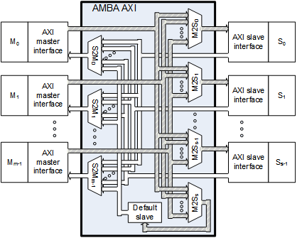
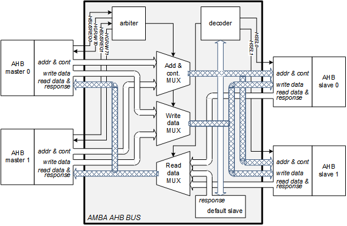
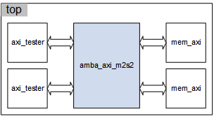
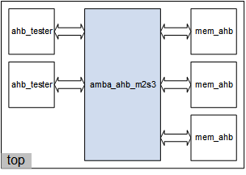
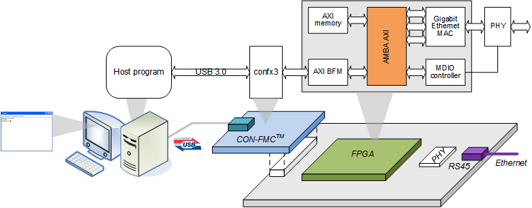
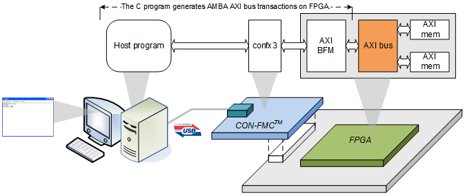
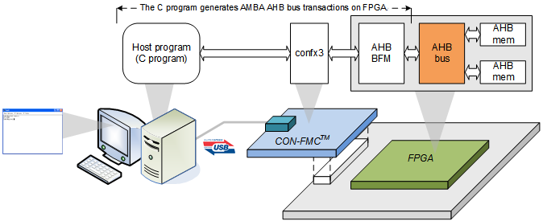

# GEN_AMBA
'gen_amba' is a set of programs that generate AMBA bus Verilog-HDL, which include AMBA AXI, AMBA AHB, and AMBA APB.
* *gen_amba_axi*: AMBA AXI bus generator for multi-master and multi-slave
* *gen_amba_ahb*: AMBA AHB bus generator for multi-master and multi-slave
* *gen_amba_apb*: AMBA APB bus-bridge generator for AMBA AXI or AHB

## License
This is licensed with the 2-clause BSD license to make the program and library useful in open and closed source products independent of their licensing scheme.

## Prerequisites
This program requires followings.
* Shell: Bash
* GNU GCC: C compiler
* HDL simulator: Mentor Graphics ModelSim or icarus Verilog

## Maturity
* RTL simulation
* FPGA proven (refer to [CON-FMC](#con_fmc))
* ASIC partially proven, but not whole yet

# 1. Quick start for AMBA AXI
### 1.1 generating AMBA AXI

   1) go to 'gen_amba_axi' directory\
      $ cd gen_amba_axi
   2) run Makefile\
      $ make cleanup\
      $ make\
      . It should generate 'gen_amba_axi'.
   3) have a look the help message\
      $ ./gen_amba_axi -h
   4) generate AMBA AXI\
      $ ./gen_amba_axi --mst=2 --slv=3 --out=amba_axi_m2s3.v\
      . It generates an AXI bus ("amba_axi_m2s3.v") with 2 master-ports and 3 slave-ports.
   
### 1.2 verification AMBA AXI

   1) go to 'gen_amba_axi/verification/sim/modelsim' directory\
      $ cd gen_amba_axi/verification/sim/modelsim\
      . Use 'iverilog' for Icarus Verilog.
   2) run Makefile\
      $ make cleanup\
      $ make MST=2 SLV=3\
      . It should generate necessary bus and top model and then invoke ModelSim simulator.\
      . It uses top-level generator.
   3) have a look the result VCD wave\
      $ gtkwave wave.vcd

# 2. Quick start for AMBA AHB
### 2.1 generating AMBA AHB

   1) go to 'gen_amba_ahb' directory\
      $ cd gen_amba_ahb
   2) run Makefile\
      $ make cleanup\
      $ make\
      . It should generate 'gen_amba_ahb'.
   3) have a look the help message\
      $ ./gen_amba_ahb -h
   4) generate AMBA AHB\
      $ ./gen_amba_ahb --mst=2 --slv=3 --out=amba_ahb_m2s3.v\
      . It generates an AHB bus ("amba_ahb_m2s3.v") with 2 master-ports and 3 slave-ports.
   
### 2.2 verification AMBA AHB

   1) go to 'gen_amba_ahb/verification/sim/modelsim' directory\
      $ cd gen_amba_ahb/verification/sim/modelsim\
      . Use 'iverilog' for Icarus Verilog.
   2) run Makefile\
      $ make cleanup\
      $ make MST=2 SLV=3\
      . It should generate necessary bus and top model and then invoke ModelSim simulator.\
      . It uses top-level generator.
   3) have a look the result VCD wave\
      $ gtkwave wave.vcd

# 3. GEN_AMBA
There is AMBA bus generator for each bus.

### 3.1 gen_amba_axi
It generates AMBA AXI switch.

```
$ ./gen_amba_axi -h
[Usage] ./gen_amba_axi [options]
	-m,--mst=num    num of masters (default: 2)
	-s,--slv=num    num of slaves  (default: 2)
	-d,--mod=str    module name (default: "amba_axi_mXsY")
	-p,--pre=str    prefix of module (default: none)
	-o,--out=file   output file name (stdout if not given)
	-v,--ver=num    verbose level  (default: 0)
	-l,--lic        print license message
	-h              print help message
```



### 3.2 gen_amba_ahb
It generates AMBA AHB bus.

```
$ ./gen_amba_ahb -h
[Usage] ./gen_amba_ahb [options]
	-t,--lite       AMBA AHB-lite
	-m,--mst=num    num of masters (default: 2)
	-s,--slv=num    num of slaves  (default: 2)
	-d,--mod=str    module name (default: "amba_ahb_mXsY")
	-p,--pre=str    prefix of module
	-o,--out=file   output file name (stdout if not given)
	-v,--ver=num    verbose level  (default: 0)
	-l,--lic        print license message
	-h              print help message
```



### 3.3 gen_amba_apb
It generates AMBA APB bus bridge for AHB or AXI.

```
$ ./gen_amba_apb -h
[Usage] ./gen_amba_apb [options]
	   --axi|ahb    make "axi_to_apb" or "ahb_to_apb" (apb if not given)
	-s,--slv=num    num of APB ports  (default: 2)
	-d,--mod=str    module name (default: "axi_to_apb_sX" or "ahb_to_apb_sX")
	-p,--pre=str    prefix of sub-module name (none if not given)
	-o,--out=file   output file name (stdout if not given)
	-v,--ver=num    verbose level  (default: 0)
	-l,--lic        print license message
	-h              print help message
```

# 4. GEN_TOP
There is top-level generator for each bus in 'verification' directory.

### 4.1 GEN_TOP for AMBA AXI
   1) go to 'gen_amba_axi/verification'\
      $ cd gen_amba_axi/verification
   2) have a look the help message\
      $ ./gen_axi_top.sh -h
   3) generate a top-level\
      $ ./gen_axi_top.sh -mst 2 -slv 2 -siz 1024 -out top.v\
      . It generates a top-level verilog ("top.v") supporting two AXI masters and two AXI memories.\
      . Each memory takes care of 1Kbyte range of memory; i.e., memory0 covers 0-1023 and memory1 covers 1024-2047.

```
$ ./gen_axi_top.sh -h
Usage : ./gen_axi_top.sh [options]
      -mst    num        :num of masters, 2
      -slv    num        :num of slaves, i.e., memories, 2
      -siz    bytes      :size of each slave in bytes, 1024
      -bus    module     :name of bus, 
      -out    file_name  :output file name, top.v
      -h/-?              :printf help
```



### 4.2 GEN_TOP for AMBA AHB
   1) go to 'gen_amba_hb/verification'\
      $ cd gen_amba_ahb/verification
   2) have a look the help message\
      $ ./gen_ahb_top.sh -h
   3) generate a top-level\
      $ ./gen_ahb_top.sh -mst 2 -slv 2 -siz 1024 -out top.v\
      . It generates a top-level verilog ("top.v") supporting two AXI masters and two AXI memories.\
      . Each memory takes care of 1Kbyte range of memory; i.e., memory0 covers 0-1023 and memory1 covers 1024-2047.

```
$ ./gen_ahb_top.sh -h
Usage : ./gen_ahb_top.sh [options]
      -mst    num        :num of masters, 2
      -slv    num        :num of slaves, i.e., memories, 2
      -siz    bytes      :size of each slave in bytes, 1024
      -bus    module     :name of bus, 
      -out    file_name  :output file name, top.v
      -h/-?              :printf help
```



### 4.3 GEN_TOP for AMBA APB
   1) go to 'gen_amba_apb/verification'\
      $ cd gen_amba_apb/verification
   2) have a look the help message\
      $ ./gen_apb_top.sh -h
   3) generate a top-level\
      $ ./gen_apb_top.sh -ahb -slv 2 -siz 1024 -out top.v\
      . It generates a top-level verilog ("top.v") supporting AHB masters and two APB memories.\
      . Each memory takes care of 1Kbyte range of memory; i.e., memory0 covers 0-1023 and memory1 covers 1024-2047.

```
$ ./gen_apb_top.sh -h
Usage : ./gen_apb_top.sh [options]
      -ahb|axi           :AHB or AXI master: ahb
      -slv    num        :num of slaves, i.e., memories, 2
      -siz    bytes      :size of each slave in bytes, 1024
      -bus    module     :name of bus, 
      -out    file_name  :output file name, top.v
      -h/-?              :printf help
```


# 5. Where to get more information
The author has been giving open lecture on AMBA bus at following two institutes.
* IDEC (IC Design Education Center) at KAIST: https://www.idec.or.kr
* SW-SoC Academy at ETRI: https://www.asic.net

# 6. Where it has been used
### <a name="con_fmc"></a>6.1 Future Design Systems (www.future-ds.com) CON-FMC<sup>TM</sup> project

#### 6.1.1 Gigabit Ethernet project



#### 6.1.2 AMBA AXI project



#### 6.1.3 AMBA AHB project



# Other things

### Autor(s)
* **[Ando Ki](andoki@gmail.com)** - *Initial work* - [Future Design Systems](http://www.future-ds.com)

### Acknoledgments

